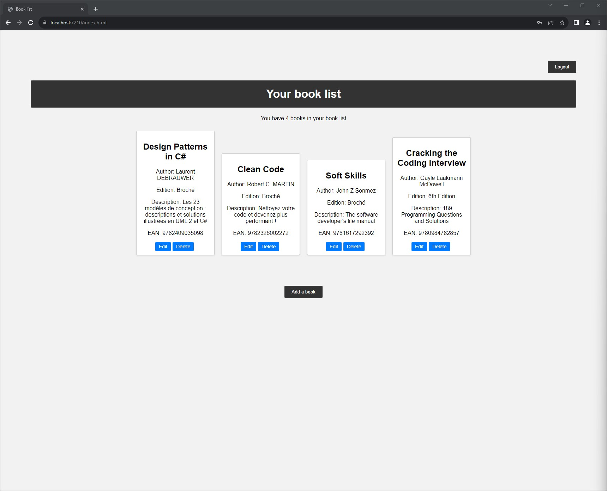

# BookAPI

BookAPI is a web application designed to manage a personal library of books.

This project enables users to record books to maintain a reading list.

The application is built with a C# .NET 6.0 backend API and a JavaScript frontend interface.

## How to install it :

```
git clone https://github.com/jorisreynes/bookAPI.git
```

```
cd bookAPI
```

-   Open the solution with Visual Studio (or another IDE if you prefer)

-   Launch the project

-   Login with "test / test"

The project is also configured with a CI/CD pipeline on Azure, ensuring that each push on GitHub triggers an automatic update of the application in production,

And is available here :

https://thebooklist.azurewebsites.net/index.html


